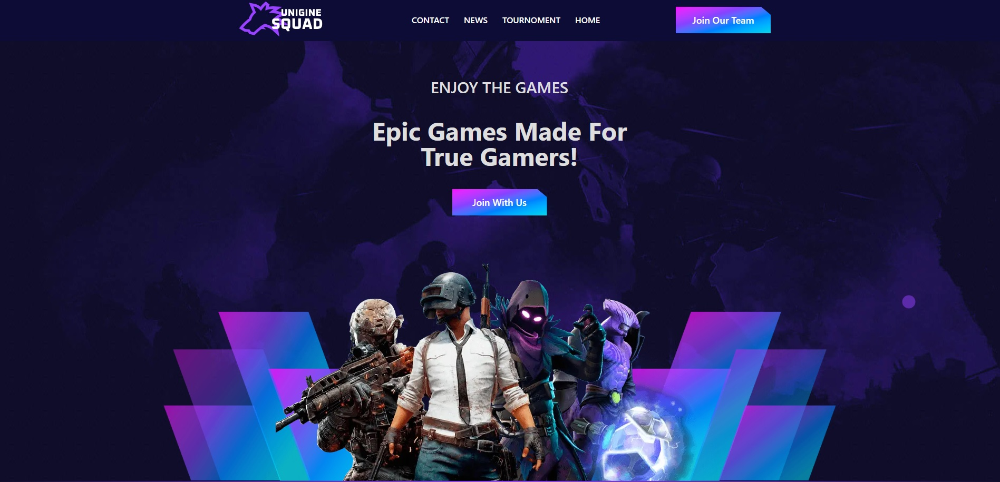
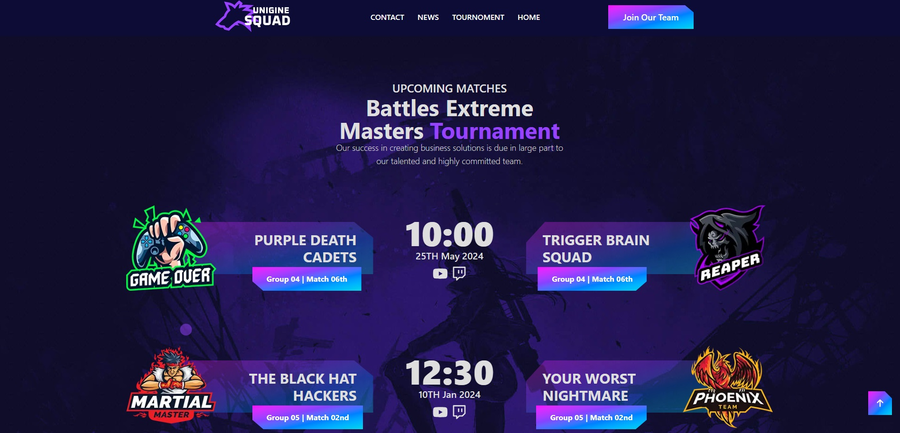
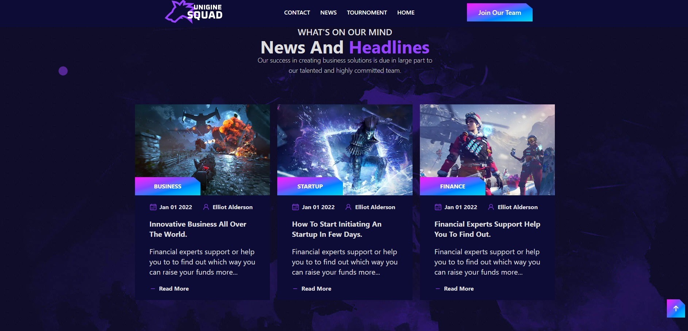

# 🎮 Gaming Website (Next.js Version)

A **modern single-page gaming website** built using **Next.js**, **React**, **TypeScript**, and **Tailwind CSS** — designed to showcase a sleek, responsive layout ideal for gaming-related brands or portfolios.

🔗 **Live Demo:** [https://gaming-website-srdo.vercel.app/](https://gaming-website-srdo.vercel.app/)

---

## ✨ Overview

The goal of this project was to **create a visually appealing and responsive gaming landing page** that highlights high-quality design, modern animations, and fast performance.
This single-page site demonstrates clean structure, reusable components, and a consistent gaming aesthetic.

---

## 🚀 Features

* 🕹️ Responsive one-page layout for gaming websites
* ⚛️ Built with **React** and **Next.js 15**
* 💅 Styled entirely with **Tailwind CSS**
* 🧱 Type-safe and scalable with **TypeScript**
* ⚡ Optimized performance and SEO-friendly
* 🎨 Smooth transitions and hover animations

---

## 🧠 Tech Stack


---

## ⚙️ Installation

```bash
# Clone the repository
git clone https://github.com/SadeghShojayefard/gaming-website.git

# Navigate into the project folder
cd gaming-website

# Install dependencies
npm install

# Run the development server
npm run dev
```

Then open [http://localhost:3000](http://localhost:3000) to preview the app locally.

---

## 🖼️ Screenshots

<p align="center">
  
  
  
</p>


---


---

## 🧑‍💻 Author

**Sadegh Shojayefard**
Frontend Developer | Web UI Enthusiast

---

## 📞 Contact

<div align="center">

[](https://sadegh-shojayee-fard.vercel.app/)
[](mailto:sadegh.shojayefar@gmail.com)
[](https://t.me/link_lover1)

</div>

---

Feel free to use and modify it for educational or portfolio purposes.
